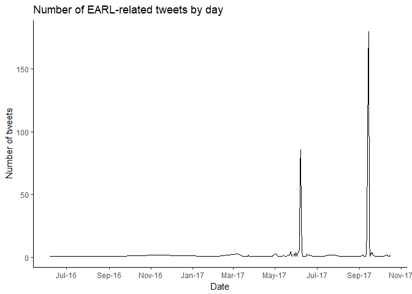
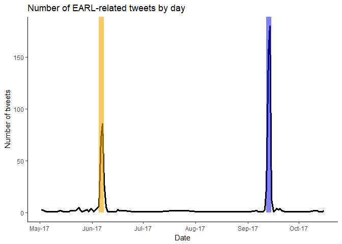

# EARL Tweets
Adnan Fiaz  


Every now and then I want to stretch my data analysis muscles and create some awesome visualisations. With two out of three EARL conferences part of R history we have a readily available topic. The data is also readily available since it's Twitter data we will be using. Twitter is an amazingly rich data source and a great starting point for a data analysis (I feel there should be a awesome-twitter-blogposts list somewhere).

I was planning on using the wonderful [rtweet](http://rtweet.info/) package by Micheal Kearney but unfortunately the Twitter API doesn't provide a full history of tweets. Instead I had to revert to a Python package (*gasp*) called [GetOldTweets](https://github.com/Jefferson-Henrique/GetOldTweets-python). I strongly recommend using the official Twitter API first before going down this path.  

### The Data


```r
# I have used the Exporter script with the hashtags #EARLConf2017, #EARLConf and #EARL2017
tweets_df <- purrr::map_df(list.files('data', full.names = TRUE), 
                           ~ readr::read_delim(.x, delim=";", quote=""))
head(tweets_df %>% select(username, date, retweets))
```

```
## # A tibble: 6 x 3
##       username                date retweets
##          <chr>              <dttm>    <int>
## 1     AlanHoKT 2017-10-02 02:15:00        0
## 2      johnon2 2017-09-23 16:02:00        0
## 3     AndySugs 2017-09-21 22:19:00        0
## 4 LearnRinaDay 2017-09-21 22:17:00        3
## 5     LouBajuk 2017-09-20 23:15:00        0
## 6     pjevrard 2017-09-20 13:02:00        0
```

First things first, let's get a timeline up:

<!-- -->

The hashtags I used to search tweets were generic so the results include tweets from last year's conferences. Let's zoom in on this year's conferences: EARL San Fransisco (5-7 June) and EARL London (12-14 September). They clearly explain the large peaks in the above graph.

<!-- -->


