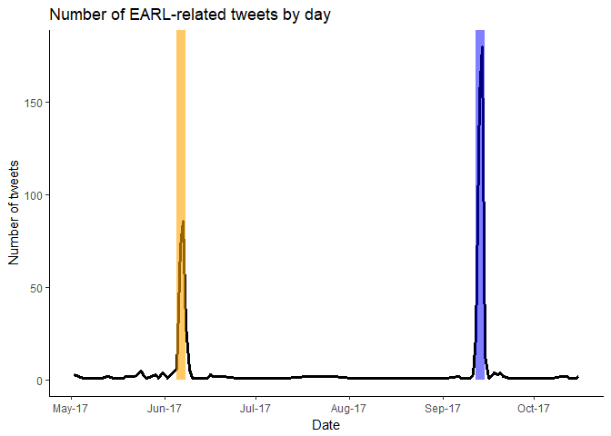

# Analysing EARL Tweets from EARL Tweeps
Adnan Fiaz  


With two out of three EARL conferences part of R history we're really excited about the next EARL conference in [Boston](https://earlconf.com/boston/) (only 1 week away!). This calls for an(other) EARL conference analysis, this time with Twitter data. Twitter is an amazingly rich data source and a great starting point for any data analysis (I feel there should be a awesome-twitter-blogposts list somewhere).

I was planning on using the wonderful [rtweet](http://rtweet.info/) package by Michael Kearney (as advertised by [Bob Rudis](https://rud.is/b/2017/10/22/a-call-to-tweets-blog-posts/)) but unfortunately the Twitter API doesn't provide a full history of tweets. Instead I had to revert to a Python package (*gasp*) called [GetOldTweets](https://github.com/Jefferson-Henrique/GetOldTweets-python). I strongly recommend using the official Twitter API first before going down this path.  

### The Data


```r
# I have used the Exporter script with the hashtags #EARLConf2017, #EARLConf and #EARL2017
tweets_df <- purrr::map_df(list.files('data/tweets', full.names = TRUE), 
                           ~ readr::read_delim(.x, delim=";", quote="")) %>% 
  # filter out company accounts
  filter(username!="earlconf", username!="MangoTheCat") %>% 
  mutate(shorttext = stringr::str_sub(text, end=50))

tweets_df %>% 
  select(username, date, shorttext) %>% 
  head() %>% 
  knitr::kable()
```


username       date                  shorttext                                          
-------------  --------------------  ---------------------------------------------------
AlanHoKT       2017-10-02 02:15:00   ". @TIBCO 's @LouBajuk spoke at #EARL2017 London o 
johnon2        2017-09-23 16:02:00   ". @TIBCO 's @LouBajuk spoke at #EARL2017 London o 
AndySugs       2017-09-21 22:19:00   "RT: LearnRinaDay: EARL London 2017 – That’s a wra 
LearnRinaDay   2017-09-21 22:17:00   "EARL London 2017 – That’s a wrap! https://www. r- 
LouBajuk       2017-09-20 23:15:00   ". @TIBCO 's @LouBajuk spoke at #EARL2017 London o 
pjevrard       2017-09-20 13:02:00   ". @TIBCO 's @LouBajuk spoke at #EARL2017 London o 

First things first, let's get a timeline up:

<!-- -->

The hashtags I used to search tweets were generic so the results include tweets from last year's conferences. Let's zoom in on this year's conferences: EARL San Francisco (5-7 June) and EARL London (12-14 September). They clearly explain the large peaks in the above graph.

<!-- -->

I've tried to highlight the period when the conferences were on but I don't quite like the result. Let's see if it works better with a bar chart.


```r
earlconf_sf_dates <- lubridate::interval("2017-06-05", "2017-06-08")
earlconf_lon_dates <-  lubridate::interval("2017-09-12", "2017-09-15")
tweets_df %>% 
  filter(date > "2017-05-01") %>% 
  mutate(day = lubridate::date(date)) %>% 
  count(day) %>% 
  mutate(conference = case_when(day %within% earlconf_sf_dates ~ "SF",
                                day %within% earlconf_lon_dates ~ "LON",
                                TRUE ~ "NONE")) %>% 
  ggplot(aes(x=day, y=n)) + 
  geom_bar(stat="identity", aes(fill=conference)) +
  scale_fill_manual(guide=FALSE, values=c("#F8766D","black","#619CFF")) +
  labs(x='Date', y='Number of tweets', title='Number of EARL-related tweets by day') +
  scale_x_date(date_breaks="1 months", labels=date_format('%b-%y')) +
  theme_classic()
```

<!-- -->

Now that's a lot better. The tweet counts in black surrounding the conferences look like small buildings which make the conference tweet counts look like giant skyscrapers (I was a failed art critic in a previous life).

### Activity during conferences

I've been to my fair share of conferences/presentations and I've always wondered how people tweet so fast during a talk. It could be just my ancient phone or I may lack the necessary skills. Either way it would be interesting to analyse the tweets at the talk level. First I will need to link the tweets to a specific talks. I've translated the published agenda into a nicer format by hand and read it in below.


```r
earl_agenda <- map_df(c("EARL_SF", "EARL_LON"), 
                      ~ readxl::read_xlsx('data/earl_agenda.xlsx', sheet = .x) )
earl_agenda %>% 
  select(StartTime, EndTime, Title, Presenter) %>% 
  head() %>% 
  knitr::kable()
```


StartTime             EndTime               Title                                                                                               Presenter           
--------------------  --------------------  --------------------------------------------------------------------------------------------------  --------------------
2017-06-06 11:00:00   2017-06-06 11:30:00   R’s role in Data Science                                                                            Joe Cheng           
2017-06-06 11:30:00   2017-06-06 12:00:00   ‘Full Stack’ Data Science with R: production data science and  engineering with open source tools   Gabriela de Queiroz 
2017-06-06 12:00:00   2017-06-06 12:30:00   R Operating Model                                                                                   Mark Sellors        
2017-06-06 11:00:00   2017-06-06 11:30:00   Large-scale reproducible simulation pipelines in R using Docker                                     Mike Gahan          
2017-06-06 11:30:00   2017-06-06 12:00:00   Using data to identify risky prescribing habits in physicians                                       Aaron Hamming       
2017-06-06 12:00:00   2017-06-06 12:30:00   How we built a Shiny App for 700 users                                                              Filip Stachura      

Before I merge the tweets with the agenda it's a good idea to zoom in on the conference tweets (who doesn't like a facetted plot).


```r
conference_tweets <- tweets_df %>% 
  mutate(conference = case_when(date %within% earlconf_sf_dates ~ "SF",
                                date %within% earlconf_lon_dates ~ "LON",
                                TRUE ~ "NONE")) %>% 
  filter(conference != "NONE")

ggplot(conference_tweets, aes(x=date)) +
  geom_histogram() +
  facet_wrap(~ conference, scales = 'free_x')
```

<!-- -->

Nothing odd in the pattern of tweets: there are no talks on the first day so barely any tweets; the amount of tweets spikes at the beginning of the other two days and then declines as the day progresses. There is something odd about the timing of the tweets though. I didn't notice it before but when I compared the position of the bars on the x-axis the San Francisco tweets look shifted. And then my lack of travel experience hit me: time zones! The tweets were recorded in UTC time but the talks obviously weren't in the evening in San Francisco. 

After correcting for time zones I can finally merge the tweets with the agenda. 


```r
selection <- conference_tweets$conference=='SF'
conference_tweets[selection, 'date'] <- conference_tweets[selection, 'date'] - 8*60*60
```


```r
# I intended to use a fuzzy join here and check if the tweet timestamp falls within the [start, end) of a talk
# unfortunately I couldn't get it to work with datetime objects
# so I resort to determining the cartesian product and simply filtering the relevant records
tweets_and_talks <- conference_tweets %>% 
  mutate(dummy = 1) %>% 
  left_join(earl_agenda %>% mutate(dummy=1)) %>% 
  filter(date >= StartTime, date < EndTime) 

tweets_and_talks %>% 
  select(username, date, shorttext, Title, Presenter) %>% 
  tail() %>% 
  knitr::kable()
```


username        date                  shorttext                                            Title                                                             Presenter  
--------------  --------------------  ---------------------------------------------------  ----------------------------------------------------------------  -----------
hspter          2017-06-06 11:17:00   "Nice shout out to @rOpenSci as prodigious package   R’s role in Data Science                                          Joe Cheng  
hspter          2017-06-06 11:17:00   "Nice shout out to @rOpenSci as prodigious package   Large-scale reproducible simulation pipelines in R using Docker   Mike Gahan 
RLadiesGlobal   2017-06-06 11:14:00   "#RLadies @b23kelly talking about #rstats at #EARL   R’s role in Data Science                                          Joe Cheng  
RLadiesGlobal   2017-06-06 11:14:00   "#RLadies @b23kelly talking about #rstats at #EARL   Large-scale reproducible simulation pipelines in R using Docker   Mike Gahan 
hspter          2017-06-06 11:14:00   "I'm digging the postmodern data scientist from @R   R’s role in Data Science                                          Joe Cheng  
hspter          2017-06-06 11:14:00   "I'm digging the postmodern data scientist from @R   Large-scale reproducible simulation pipelines in R using Docker   Mike Gahan 

You ever have that feeling that you're forgetting something and then you're at the airport without your passport? From the above table it's obvious I've forgotten that talks are organised in parallel. So matching on time only will create duplicates. However, you may notice that some tweets also mention the presenter (that is considered good tweetiquette). We can use that information to further improve the matching.


```r
talks_and_tweets <- tweets_and_talks %>% 
  # calculate various scores based on what is said in the tweet text
  mutate(presenter_score = ifelse(!is.na(mentions) & !is.na(TwitterHandle),  stringr::str_detect(mentions, TwitterHandle), 0),
         # check if the presenter's name is mentioned
         presenter_score2 = stringr::str_detect(text, Presenter),
         # check if the company name is mentioned
         company_score = stringr::str_detect(text, Company),
         # check if what is mentioned has any overlap with the title (description would've been better)
         overall_score = stringsim(text, Title),
         # sum all the scores
         score = overall_score + presenter_score + presenter_score2 + company_score) %>% 
  select(-presenter_score, -presenter_score2, -company_score, -overall_score) %>% 
  # now select the highest scoring match
  group_by(username, date) %>% 
  top_n(1, score) %>% 
  ungroup()

talks_and_tweets %>% 
  select(username, date, shorttext, Title, Presenter) %>% 
  tail() %>% 
  knitr::kable()
```


username        date                  shorttext                                            Title                                                                                               Presenter           
--------------  --------------------  ---------------------------------------------------  --------------------------------------------------------------------------------------------------  --------------------
Madhuraraju     2017-06-06 11:39:00   "@aj2z @gdequeiroz from @SelfScore talking about u   ‘Full Stack’ Data Science with R: production data science and  engineering with open source tools   Gabriela de Queiroz 
hspter          2017-06-06 11:22:00   "#rstats is great for achieving "flow" while doing   R’s role in Data Science                                                                            Joe Cheng           
RLadiesGlobal   2017-06-06 11:20:00   "@RStudioJoe showing the #RLadies logo and a big m   R’s role in Data Science                                                                            Joe Cheng           
hspter          2017-06-06 11:17:00   "Nice shout out to @rOpenSci as prodigious package   Large-scale reproducible simulation pipelines in R using Docker                                     Mike Gahan          
RLadiesGlobal   2017-06-06 11:14:00   "#RLadies @b23kelly talking about #rstats at #EARL   Large-scale reproducible simulation pipelines in R using Docker                                     Mike Gahan          
hspter          2017-06-06 11:14:00   "I'm digging the postmodern data scientist from @R   R’s role in Data Science                                                                            Joe Cheng           

That looks better but I am disappointed at the number of tweets (263) during talks. Maybe attendees are too busy listening to the talk instead of tweeting which is a good thing I suppose. Nevertheless I can still try to create some interesting visualisations with this data.


```r
tweets_by_presenter <- talks_and_tweets %>%  
  count(conference, Title, Presenter) %>% 
  ungroup() %>% 
  arrange(conference, n)

tweets_by_presenter$Presenter <- factor(tweets_by_presenter$Presenter, levels=tweets_by_presenter$Presenter)
```
<!-- -->


The visualisation doesn't really work for the large number of presenters although I don't really see another way to add the information about a talk. I also tried to sort the levels of the factor so they appear sorted in the plot but for some reason the _SF_ facet doesn't want to cooperate. There are a number of talks vying for the top spot in San Francisco but the differences aren't that large. I'm of course assuming my matching heuristic worked perfectly but one or two mismatches and the results could look completely different. The same applies to EARL London but here Joe Cheng clearly takes the crown. 

### Follow the leader...

Let's go down a somewhat more creepy road and see what talks people go to. 


```r
tweeters <- talks_and_tweets %>% 
  group_by(username) %>% 
  mutate(num_tweets = n()) %>% 
  ungroup() %>% 
  filter(num_tweets > 4) %>% 
  mutate(day = ifelse(conference == "SF", (Session > 6)+1, (Session > 9)+1),
         day = ifelse(day==1, "Day 1", "Day 2")) %>% 
  select(username, conference, StartTime, Stream, day) 
```
<!-- -->
<!-- -->

Each line is a twitter user (twitterer? tweeter? tweep?) and each observation represents a tweet during a presentation. My expectation was that by drawing a line between the observations you could see how people switch (or don't switch) between talks. That has clearly failed as the tweeting behaviour isn't consistent or numerous enough to actually see that. I'm quite glad it's not possible since tracking people isn't what Twitter is for.

The code and data for this blogpost are available on GitHub so feel free to play around with it yourself. Do let us know if you create any awesome visualisations or if we can improve on any of the above. If you also want to tweet at conferences, EARL Boston is happening on 1-3 November and [tickets](https://ti.to/earl-conference/boston-2017) are still available. I promise we won't track you!  


